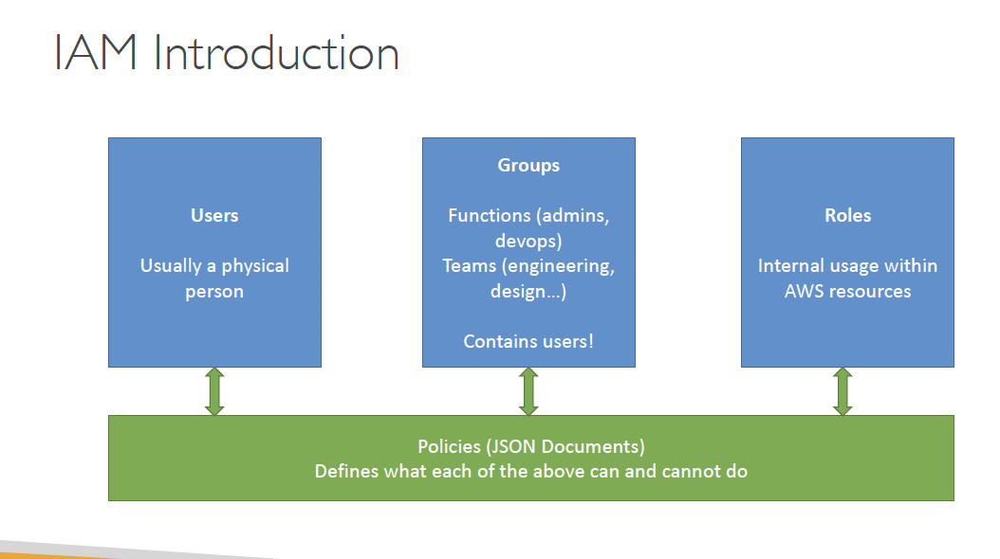
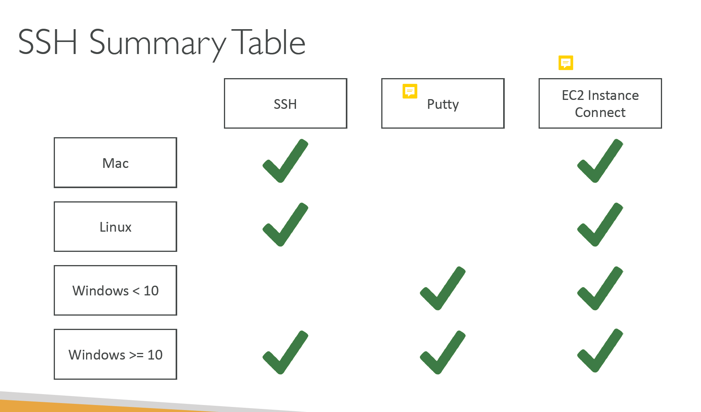

## Day 1 - AWS Fundamentals

### AWS Regions
- A region is a cluster of data centers
- Most AWS services are region-scoped

### AWS Availability Zones
- Each region has many availability zones (usually 3, min is 2, max is 6).
- Each availability zone (AZ) is one or more discrete data centers with redundant power, networking, and connectivity
- They’re separate from each other, so that they’re isolated from disasters
- They’re connected with high bandwidth, ultra-low latency networking

### AWS shared responsibility model
- EC2 -> **IaaS** (infrastructure as a service)
- AWS Relational Database -> PaaS (platform as a service)
- AWS Shield, AWS Chime, AWS Trusted Advisor -> SaaS (software as a service, provide an out of box software service)

### IAM

#### IAM essential components 
- user, group, policy, role
- role: for granting temporary access to AWS services

#### IAM - identity and Access Management
  -  use IAM to manage AWS resources
  -  a resource is an entity you can work with, e.g. EC2 instance / S3 bucket
  - defines fine-grained access rights - who, which, how
  - a no cost feature
    
#### IAM Brain Dump
- One IAM User per **PHYSICAL** PERSON
- One IAM Role per **Application**
- IAM credentials should NEVER BE SHARED
- Never, ever, ever, ever, write IAM credentials in code. EVER.
- Never use the ROOT account except for initial setup.
- Never use ROOT IAM Credentials

### EC2
EC2 is one of most popular of AWS offering
-  It mainly consists in the capability of :
    - Renting virtual machines (EC2)
    - Storing data on virtual drives (EBS)
    - Distributing load across machines (ELB)
    - Scaling the services using an auto-scaling group (ASG)

- ps:  
   - Putty is a drop-in replacement for SSH
   - EC2 Instance Connect allows you to connect to your EC2 Instance directly from your browser on any operating system.

