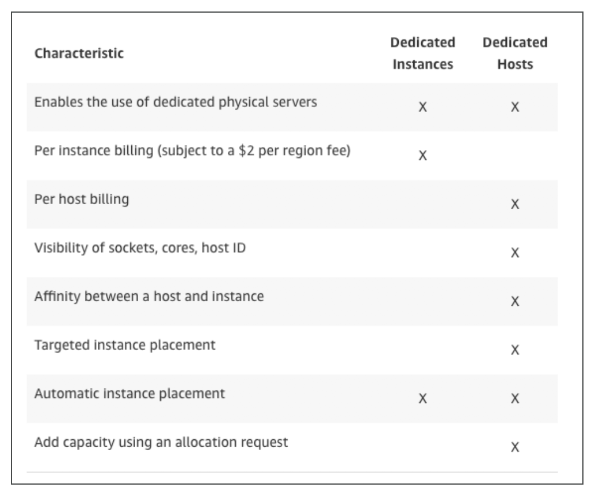

# Day 3 - EC2 

## EC2 User Data
- It is possible to bootstrap our instances using an EC2 User data script.
- bootstrapping means launching commands when a machine starts
- That script is only run once at the instance first start
- EC2 user data is used to automate boot tasks such as:
    - Installing updates
    - Installing software
    - Downloading common files from the internet
- Anything you can think of
- The EC2 User Data Script runs with the root user

####  * Remember, EC2 User Date is automatically with the sudo command

###
#### Wrong test question
- You are getting a permission error exception when trying to SSH into your Linux Instance
  - The key is missing perimissions chmod 0400
  

## EC2 Instance Launch Types
- **On Demand Instances**: short workload, predictable pricing
- **Reserved**: (MINIMUM 1 year)
    - Reserved Instances: long workloads
    - Convertible Reserved Instances: long workloads with flexible instances
    - Scheduled Reserved Instances: example – *every Thursday between 3 and 6 pm*
- **Spot Instances**: short workloads, for cheap, can lose instances (less reliable)
- **Dedicated Instances**: no other customers will share your hardware
- **Dedicated Hosts**: book an entire physical server, control instance placement

### EC2 On Demand - great for elastic workloads
- Pay for what you use (billing per second, after the first minute)
- Has the highest cost but no upfront payment
- No long term commitment
- Recommended for short-term and un-interrupted workloads, where you can't predict how the application will behave.

### EC2 Reserved Instances
- Up to 75% discount compared to On-demand
- Pay upfront for what you use with long term commitment
- Reservation period can be 1 or 3 years
- Reserve a specific instance type
- Recommended for steady state usage applications (think database)
- **Convertible Reserved Instance**
    - can change the EC2 instance type
    - Up to 54% discount
- **Scheduled Reserved Instances**
    - launch within time window you reserve
    - When you require a fraction of day / week / month

### EC2 Spot Instances
- Can get a discount of up to 90% compared to On-demand
- Instances that you can “lose” at any point of time if your max price is less than the current spot price
- The MOST cost-efficient instances in AWS
- **Useful for workloads that are resilient to failure**
    - Batch jobs
    - **Data analysis**
    - Image processing
    - …
- Not great for critical jobs or databases
- Great combo: Reserved Instances for baseline + On-Demand & Spot for peaks
 
### EC2 Dedicated Hosts
- Physical dedicated EC2 server for your use
- Full control of EC2 Instance placement
- Visibility into the underlying sockets / physical cores of the hardware
- Allocated for your account for a 3 year period reservation
- More expensive
- Useful for software that have complicated licensing model (BYOL – Bring Your Own License)
- Or for companies that have strong regulatory or compliance needs

### EC2 Dedicated Instances
- Instances running on hardware that’s dedicated to you
- May share hardware with other instances in same account
• No control over instance placement (can move hardware after Stop / Start)
  
#### Difference between EC2 Dedicated Instances & EC2 Dedicated Hosts

### Wrap up
