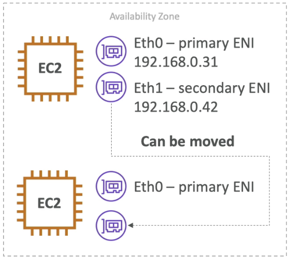

# Day 4: Elastic Network Interfaces (ENI)

- Logical component in a VPC that represents a virtual network card
    - you can attach ENI to EC2 instances and detach them
    - primary ENI - eth0: can"t detach
    - secondary ENI - eth1: can be detached and reattached
    - eth0 and eth1 are different
- The ENI can have the following attributes:
    - Primary private IPv4, one for more secondary IPv4
    - One Elastic IP (IPv4) per private IPv4
    - One Public IPv4
    - One or more SGs attach to the ENI
    - A MAC address attach to it
    
- You can create ENI independently and attach them on the fly (move them) on EC2 instances for failover. 
- Bound to a specific availability zone (AZ)

[AWS News Blog - New - Elastic Network Interfaces in the Virtual Private Cloud](https://aws.amazon.com/blogs/aws/new-elastic-network-interfaces-in-the-virtual-private-cloud/)
##

     
