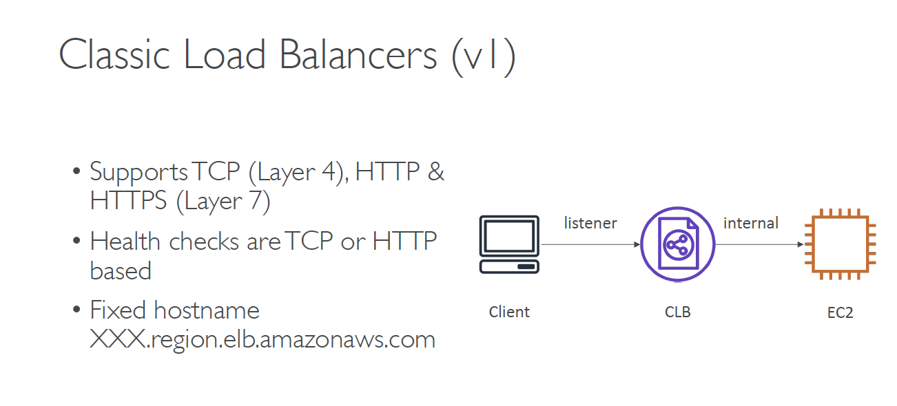

# Day 7- 

## High Availability & Scalability For EC2
-**Vertical Scaling**: Increase instance size (= scale up / down)
    - From: t2.nano - 0.5G of RAM, 1 vCPU
    - To: u-12tb1.metal – 12.3 TB of RAM, 448 vCPUs

- **Horizontal Scaling**: Increase number of instances (= scale out / in)
    - Auto Scaling Group
    - Load Balancer

- **High Availability**: Run instances for the same application across multi AZ
    - Auto Scaling Group multi AZ
    - Load Balancer multi AZ
    
## Load balancing
Load balancers are servers that forward internet traffic to multiple
servers (EC2 Instances) downstream.
- Spread load across multiple downstream instances 
  
- Expose a single point of access (DNS) to your application

- Seamlessly handle failures of downstream instances

- Do regular health checks to your instances

- Provide SSL termination (HTTPS) for your websites

- Enforce stickiness with cookies

- High availability across zones

- Separate public traffic from private traffic

### Health Checks are crucial for Load Balancers
- They enable the load balancer to know if instances it forwards traffic to
are available to reply to requests
- The health check is done on a port and a route (/health is common)
- If the response is not 200 (OK), then the instance is unhealthy

## Types of load balancer on AWS
- **Classic Load Balancer** (**v1** - old generation) – 2009
    - HTTP, HTTPS, TCP
  
- **Application Load Balancer** (**v2** - new generation) – 2016
    - HTTP, HTTPS, WebSocket
- **Network Load Balancer** (**v2** - new generation) – 2017
    - TCP, TLS (secure TCP) & UDP
- Overall, it is recommended to use the newer / v2 generation load balancers as they
provide more features
- You can setup **internal (private)** or **external (public)** ELBs

### Load Balancer Good to Know
- LBs can scale but not instantaneously – contact AWS for a “warm-up”
- Troubleshooting
    - 4xx errors are client induced errors
    - 5xx errors are application induced errors
    - Load Balancer Errors 503 means at capacity or no registered target (it's overloading)
    - If the LB can’t connect to your application, check your security groups!
- Monitoring
    - ELB access logs will log all access requests (so you can debug per request)
    - CloudWatch Metrics will give you aggregate statistics (ex: connections count)