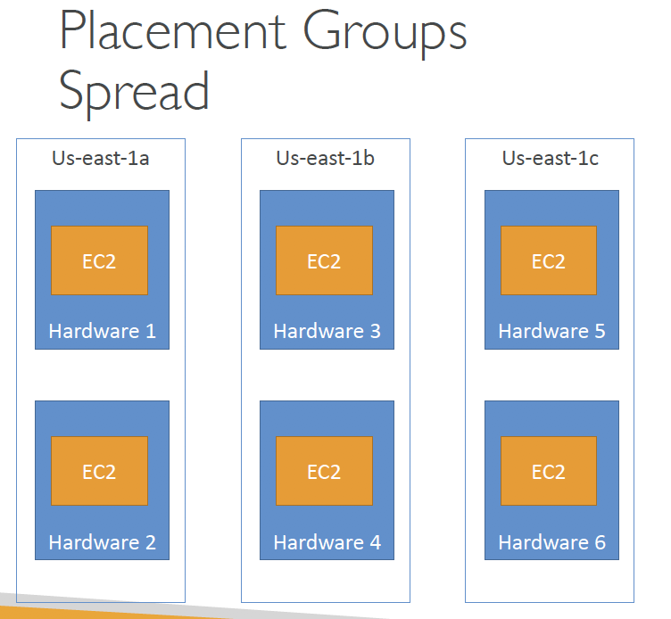
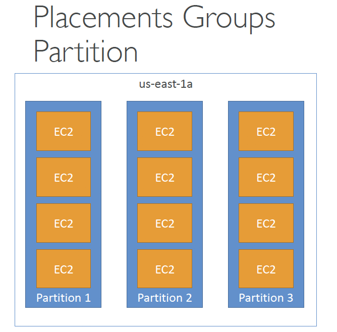
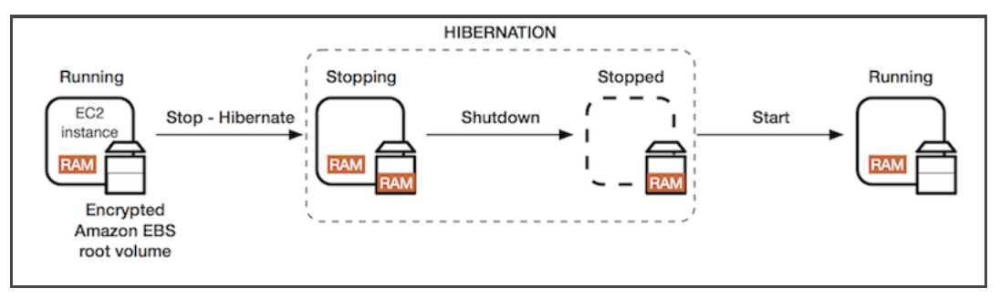

# Solutions Architect Associate Prepare - Day 1

## EC2 Spot Instance 
More details go back to [Day 3- Instance Types](Journey/003/Readme.md)
- The hourly spot price varies based on offer and capacity
- If the current spot price > your max price you can choose to stop or terminate your
  instance with a 2 minutes grace period.
  
**Spot  Block**: “block” spot instance during a specified time frame (1 to 6 hours) without interruptions

### Spot Request
- Includes: Maximum price, Desired number of instances, launch specification (AMI...), request type, valid from, valid until
  
### Two types for post instances: 
### one-time
-  as soon as spot request is fulfilled, instances are going to be launched.
-  then spot request will be go away / invalid
###  persistent
- **Desired number of instances** will be valid as long as the spot request is **valid from** to **valid until**
- If spot instances is stopped in persistent mode, the spot request  is still active and it will automatically restart sopt instances. 

### How to terminate Spot Instances?
- You can only cancel Spot Instance requests that are **open**, **active**, or **disabled**
- **Cancelling a Spot Request does not terminate instances**
- Your responsibility to terminate the spot instances
  1. First, cancel a Spot Request
  2. then terminate the associated Spot Instances
  

- Note: if only terminate spot instances and not cancel spot request, after spot instances terminated, spot request will launch new spot instances

## Spot Fleets
- Spot Fleets = set of Spot Instances + (optional) On-Demand Instances
- The Spot Fleet will try to meet the target capacity with price constraints
  - Define possible launch pools: instance type (m5.large), OS, Availability Zone
  - have multiple launch pools
  - Spot Fleet stops launching instances when reaching capacity or max cost

### Strategies to allocate Spot Instances:
- lowestPrice: from the pool with the lowest price (cost optimization, short workload)
- diversified: distributed across all pools (great for availability, long workloads)
- capacityOptimized: pool with the optimal capacity for the number of instances

## EC2 Instance Types – Main ones
- R: applications that needs a lot of RAM – in-memory caches
- C: applications that needs good CPU – compute / databases
- M: applications that are balanced (think “medium”) – general / web app
- I: applications that need good local I/O (instance storage) – databases
- G: applications that need a GPU – video rendering / machine learning
- T2 / T3 burstable instances (up to a capacity)
- T2 / T3 unlimited: unlimited burst
- Real-world tip: use [https://www.ec2instances.info](https://www.ec2instances.info)

### Burstable Instances (T2/T3)
- Burst means that overall, the instance has OK CPU performance
- When the machine needs to process something unexpected (a spike in
  load for example), it can burst, and CPU can be VERY good.
- If the machine bursts, it utilizes “burst credits”
- If all the credits are gone, the CPU becomes BAD
- If the machine stops bursting, credits are accumulated over time

#### If your instance consistently runs low on credit, you need to move to a different kind of non-burstable instance
- The bigger the instance, the faster you're gonna earn credits

**CloudWatch** can see the credit usage and balance

### T2/T3 Unlimited
- have an “unlimited burst credit balance”
- Pay extra money if you go over your credit balance, but you don’t
  lose in performance
- Costs could go high if not monitoring the health of your instances

## AMI
- An image to use to create our instances
- AMIs can be built for Linux or Windows machines
- AMI are built for a **specific AWS region**
- You can buy AMIs from other people on the Amazon Marketplace and pay for by the hour

### AMI Storage
- AMI live in Amazon S3 (but you won’t see them in the S3 console)
- By default, AMIs are private, and locked for your account / region
- You can also make your AMIs public and share them with other AWS
  accounts or sell them on the AMI Marketplace 
  
### AMI Pricing
- Get charged for the actual space in takes in Amazon S3
- Quite inexpensive to store private AMIs
- Make sure to remove the AMIs you don’t use

### Cross Account AMI Copy (FAQ + Exam Tip)
- Can share an AMI with another AWS account
- Sharing an AMI does not affect the ownership of the AMI
- If you copy an AMI that has been shared with your account, you are the owner of the target AMI in your account.
- To copy an AMI that was shared with you from another account, the owner of the source AMI must grant you read permissions for the storage that backs the AMI, either the associated EBS snapshot(for an Amazon EBS-backed AMI) or an associated S3 bucket (for an instance store-backed AMI).
  
### Exam Tips:
- You **can't copy** an AMI with an associated **billingProduct** code that was shared with you from another account. This includes Windows AMIs and AMIs from the AWS Marketplace. 
   - How to copy a shared AMI with a billingProduct code? 
     1. launch an EC2 instance in your account using the shared AMI 
     2. then create an AMI from the instance.
  
- You **can't copy** an **encrypted AMI** that was shared with you from another account. Instead, if the underlying snapshot and encryption key were shared with you, you can copy the snapshot while reencrypting it with a key of your own. You own the copied snapshot, and can register it as a new AMI.

## Placement Groups
- Use Placement Groups to control over the EC2 Instances  to meet the needs of your workload

### Placement strategies 
#### Cluster
- Packs instances close together in same rack in an AZ
- Pros: 
  - Great network (10 Gbps bandwidth between instances)
  - low-latency
- Cons: If the rack fails, all instances fails at the same time
- Use case:
  - Big Data job that needs to complete fast
  - Application that needs extremely low latency and high network throughput
  
! Cluster group is available only for high instance type 
  
#### Spread

- Pros:
  - Spreads instances across underlying physical hardware across Availability Zones (AZ)
  - Reduced risk is simultaneous failure
- Cons:
  - Limited to **7 instances per AZ** per placement group
- Use case:
  - Application that needs to maximize **high availability**
  - Critical Applications where each instance must be isolated from failure from each other

#### Partition

- Up to 7 partitions per AZ
- Up to 100s of EC2 instances per group
- The instances in a partition do not share racks with the instances in the other partitions
- A partition failure can affect many EC2 but won’t affect other partitions
- EC2 instances get access to the partition information as metadata
- This strategy is typically used by large distributed and replicated workloads, such as Hadoop, Cassandra, and Kafka.

## EC2 Hibernate
- The in-memory (RAM) state is preserved
- The instance boot is much faster (the OS is not stopped / restarted)
- Under the hood: the RAM state is written to a file in the root EBS volume
- The root EBS volume must be encrypted

#### The working process of Hibernate

#### Use cases:
  - long-running processing
  - saving the RAM state
  - services that take time to initialize

#### EC2 Hibernate – Good to know
- Supported instance families - C3, C4, C5, M3, M4, M5, R3, R4, and R5.
- Instance RAM size - must be less than 150 GB.
- Instance size - not supported for bare metal instances.
- AMI: Amazon Linux 2, Linux AMI, Ubuntu & Windows…
- Root Volume: must be EBS, encrypted, not instance store, and large
- Available for On-Demand and Reserved Instances
- An instance cannot be hibernated more than 60 days

## Exam Tips - EC2 for Solutions Architects
- EC2 instances are billed by the second, t2.micro is free tier
- On Linux / Mac we use SSH, on Windows we use Putty
- SSH is on port 22, lock down the security group to your IP
- Timeout issues => Security groups issues
- Permission issues on the SSH key => run “chmod 0400”
- Security Groups can reference other Security Groups instead of IP
ranges (very popular exam question)
- Know the difference between Private, Public and Elastic IP
- You can customize an EC2 instance at boot time using EC2 User Data
- Know the 4 EC2 launch modes:
  - On demand
  - Reserved
  - Spot instances
  - Dedicated Hosts
- Know the basic instance types: R,C,M,I,G, T2/T3
- You can create AMIs to pre-install software on your EC2 => faster boot
- AMI can be copied across regions and accounts
- EC2 instances can be started in placement groups:
  - Cluster
  - Spread