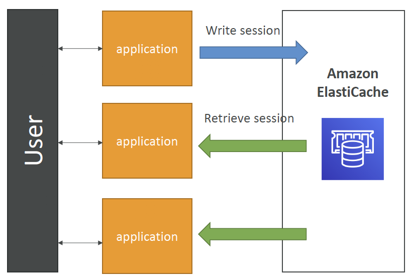

# SAA Prepare - Day 3: ElastiCache & Route 53

## Amazon ElastiCache
- The same way RDS is to get managed Relational Databases…
- ElastiCache is to get managed Redis or Memcached
- Caches are in-memory databases with really high performance, low latency
- Helps reduce load off of databases for read intensive workloads
- Helps make your application stateless
- AWS takes care of OS maintenance / patching, optimizations, setup, configuration, monitoring, failure recovery and backups
- Using ElastiCache involves heavy application code changes

### Two common use cases
#### Load read workload off database

         Lazy Loading illustrated
- Application queries ElastiCache (cache hit), if not available (cache miss), get from RDS and write to cache (store in ElastiCache)
- Cache must have an invalidation strategy to make sure only the most current data is cached

#### User Session Store

- User logs into any of the application instances
- The application writes the session data into ElastiCache
- User hits another instance
- The other instance retrieves the data, and the user is logged in

### Cluster engine: Redis vs Memcached
#### Redis
- Similar to RDS
- Multi AZ with Auto-Failover
- **Read Replicas** to scale reads and have **high availability**
- Data Durability using AOF persistence
- **Backup and restore features**
- Used as a database, cache, and message broker

#### Memcached
- Sharding: Multi-node for partitioning of data 
- Non persistent
- No backup and restore
- Multi-threaded architecture
- High-performance
- Distributed memory object caching system (intended to serve as a pure cache)

### ElastiCache – Cache Security
- All caches in ElastiCache:
    - Support SSL in flight encryption
    - Do not support IAM authentication
    - IAM policies on ElastiCache are only used for AWS API-level security
- Redis AUTH (authentication)
    - You can set a “password/token” when you create a Redis cluster
    - This is an extra level of security for your cache(on top of security groups)
    - By default, Redis does not have any AUTH and anything or anyone can connect to your Redis cluster
- Memcached
    - Supports SASL-based authentication (advanced)

## ElastiCache for Solutions Architects
### Patterns for ElastiCache
- Lazy Loading: all the read data is cached, data can become stale in cache
- Write Through: Adds or update data in the cache when written to a DB (no stale data)
- Session Store: store temporary session data in a cache (using TTL features)

### Questions:

- Q: Which RDS Classic (not Aurora) feature does not require us to change our SQL connection string?

- A: Multi AZ

- Multi AZ keeps the same connection string regardless of which database is up. Read Replicas imply we need to reference them individually in our application as each read replica will have its own DNS name

- Q: Your application functions on an ASG behind an ALB. Users have to constantly log back in and you'd rather not enable stickiness on your ALB as you fear it will overload some servers. What should you do?
- A: Store session data in ElastiCache
- Storing Session Data in ElastiCache is a common pattern to ensuring different instances can retrieve your user's state if needed.

## Route 53
- Route53 is a Managed DNS (Domain Name System)
- DNS is a collection of rules and records which helps clients understand how to reach a server through URLs

### Common Types of Records
- A: hostname to IPv4
- AAAA: hostname to IPv6
- CNAME: hostname to hostname
- Alias: hostname to AWS resource

### Route53 can use:
- public domain names you own (or buy)
- private domain names that can be resolved by your instances in your VPCs

### Route53 has advanced features such as:
- Load balancing (through DNS – also called client load balancing)
- Health checks (although limited…)
- Routing policy: simple, failover, geolocation, latency, weighted, multi value

### Pricing
$0.50 per month per hosted zone

## DNS Records TTL (Time to Live)

- The DNS record will be cached on the client side for the TTL period
- TTL is sent together with the response to DNS queries, therefore decided on the DNS server side
- Therefore, an update on the DNS record might not reach the clients immediately. Have to **wait for the client's cached records to expire**
  
- High TTL: e.g. 24 hrs
    - Less traffic on DNS
    - Possibly outdated records
- Low TTL: e.g. 60s
    - More traffic on DNS
    - Records are outdated for less time
    - Easy to change records
    
#### TTL is mandatory to each DNS record

## CNAME vs Alias
Scenario： AWS Resources (Load Balancer, CloudFront…) expose an AWS hostname: `lb1-1234.us-east-2.elb.amazonaws.co` and you want `myapp.mydomain.com`
### CNAME
- Points a hostname to any other hostname. (app.mydomain.com => blabla.anything.com)
- ONLY FOR **NON ROOT DOMAIN** (works for `app.mydomain.com` but not `mydomain.come`)
### Alias:
- Points a hostname to an AWS Resource (`app.mydomain.com` => `blabla.amazonaws.com`)
- Works for both **ROOT DOMAIN** and **NON ROOT DOMAIN**
- Free of charge
- Native health check

When you are asked whether to use CNAME ane Alias？
  - Generally if you want to point to an AWS resource, Alias is the better choice: free, native health check, more flexible

