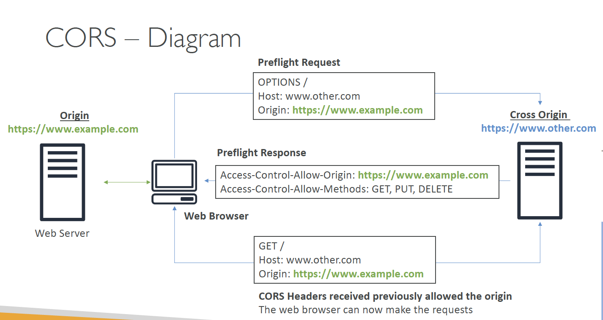

# 
## Instantiating Applications quickly
- EC2 Instances:
    - Use a Golden AMI: Install your applications, OS dependencies etc.. beforehand and launch your EC2 instance from the Golden AMI
  - Bootstrap using User Data: For dynamic configuration, use UserData scripts
  - Hybrid: mix Golden AMI and User Data (**Elastic Beanstalk**)
- RDS Databases:
    - Restore from a snapshot: the database will have schemas and data ready!
- EBS Volumes:
    - Restore from a snapshot: the disk will already be formatted and have data
  
## AWS Elastic Beanstalk
- Elastic Beanstalk is a developer centric view of deploying an application on AWS
- Beanstalk is free but you pay for the underlying instances

- Managed service
  - Instance configuration / OS is handled by Beanstalk
  - Deployment strategy is configurable but performed by Elastic Beanstalk
- Just the application code is the responsibility of the developer
### Three architecture models:
- Single Instance deployment: good for dev
- LB + ASG: great for production or pre-production web applications
- ASG only: great for non-web apps in production (workers, etc..)

- Elastic Beanstalk has three components
  - Application
  - Application version: each deployment gets assigned a version
  - Environment name (dev, test, prod…): free naming

- You deploy application versions to environments and can promote application versions to the next environment
- Rollback feature to previous application version
- Full control over lifecycle of environments

- Support for many platforms: Go, Java SE, Node.js, Python ...
- If not supported, you can write
  your custom platform (advanced)
  
## S3
### S3 Buckets
#### Object key
- globally unique name
- defined at the region level
- naming: No uppercase & underscore
- name must start with lowercase letter or number

### S3 Objects
- Objects (files) have a Key
- The key is composed of **prefix** + **object name**
  - `s3://my-bucket/my_folder1/another_folder/my_file.txt` is the key
  - `my_folder1/another_folder/` is the prefix
  - `my_file.txt` is the object name
  
- There is no "directories" concepts within buckets, although the UI makes you think there is, but it's really **a long key that can contain slashes**

#### Object values
- Object values are the content of the body
- Max Object Size is 5TB (5000GB)
- If uploading more than 5GB, **must** use “multi-part upload”

- Metadata
  - Metadata: list of text key/value pairs
  - Could be system or user metadata, adding information to your object
- Tags
  - Unicode key/value pair, up to 10.
  - Useful for security/lifecycle
  

### Versioning
- An object can have a version ID, if versioning is enabled at the bucket level
- Same key overwrite will increment the “version”
- Best practice: version your buckets
- Any file that's not versioned prior to enabling versioning will have version `null`
- Suspending versioning does not delete the previous versions. It just ensures no version is assigned to future versions. 

## S3 Security
### Encryption at Rest
#### SSE-S3
- encryption using keys handled & managed by Amazon S3 (server side)
- AES-256 encryption type
- Must set **header**: `“x-amz-server-side-encryption": "AES256"`
- Use HTTP/S + **Header**, and S3 will read in the above header and know that it should encrypt the object with the key it owns and is managing

#### SSE-KMS
- encryption using keys handled & managed by KMS
- KMS Advantages: user control + audit trail
- Must set **header**: `“x-amz-server-side-encryption": ”aws:kms"`
- Use HTTP/S + **header**, and s3 knows it should use the KMS Customer Master Key (CMK) to encrypt the object

#### SSE-C
- server-side encryption using data keys fully managed by the customer outside of AWS
- Amazon S3 does not store the encryption key you provide
- HTTPS must be used
- Encryption key must provided in HTTP headers, for every HTTP request made
- Send (Object + key) via HTTPS, Data key in header
- S3 receives the object and the client-provided key, and encrypts the object before storing it into the bucket.
- Not available via Console. Have to use command line interface (CLI)

#### Client Side Encryption
- Client library such as the Amazon S3 Encryption Client
- Clients must encrypt data themselves before sending to S3
- Clients must decrypt data themselves when retrieving from S3
- Customer fully manages the keys and encryption cycle
- Upload the already-encrypted object via HTTP or HTTPS

### Encryption in transit (SSL/TLS)
- Amazon S3 exposes:
  - HTTP endpoint: non encrypted
  - HTTPS endpoint: encryption in flight (Encryption in flight is also called SSL / TLS)
  - HTTPS is recommended, most clients would use the HTTPS endpoint by default
  - HTTPS is **mandatory for SSE-C**

## S3 access control
- User based
  - IAM policies: which API calls should be allowed for a specific user from IAM console
- Resource based
  - Bucket policies: bucket-wide policies from S3 console, allows cross-account.
  - Object access control list: finer grain
  - Bucket access control list: less common
- An IAM principle can access an S3 object if:
  1. The user IAM permissions allows it OR the resource policy allows it
  2. AND there is no explicit DENY
  
### S3 Bucket Policies
- JSON based policies
  - Resources: buckets and objects
  - Actions: Set of API to Allow or Deny, e.g. `s3: GetObject`
  - Effect: Allow / Deny
  - Principal: The account or user to apply the policy to
- Use S3 bucket for policy to:
  - Grant public access to the bucket
  - Force objects to be encrypted at upload
  - Grant access to another account (Cross Account)
  
### Bucket settings for Block Public Access
- There are ways to block public access to buckets, to prevent company data leaks
- There is a way to block public access on account level

#### Others

- Networking:
  - Supports VPC Endpoints (for instances in VPC without www internet)
- Logging and Audit:
  - S3 Access Logs can be stored in other S3 bucket
  - API calls can be logged in AWS CloudTrail
- User Security:
  - MFA Delete: MFA (multi factor authentication) can be required in versioned buckets to delete objects
  - Pre-Signed URLs: URLs that are valid only for a limited time (ex: premium video service for logged in users)

### S3 Websites
- S3 can host static websites and have them accessible on the www
- The website URL will be: `<bucket-name>.s3-website-<AWS-region>.amazonaws.com`
- If you get a 403 (Forbidden) error, make sure the bucket policy allows public reads
- How to make S3 bucket public?
  1. Disable the Block public access setting
  2. To write a bucket policy which allows public access
      - Use `Policy generator` to policy JSON document

## CORS 
- Origin: an origin is a scheme (protocol), a host (domain) and port (https implies 443 and http implies 80, so don't have to specify port number)
- CORS means Cross-Origin Resource Sharing
- **Web browser based** mechanism to allow requests to other origins while visiting the main origin

### Same/different origins
- `http://example.com/app1` and `http://example.com/app2` are the same origin. Same scheme, same host(domain), same port.
- `http://www.example.com` and `http://other.example.com` are different regions: different hosts.
- The requests won't be filled unless the request-receiving side origin allows for the requests, using **CORS headers** (Access-Control-Allow-Origin)
  
  
### Popular exam question
- If a client does a cross-origin request on our S3 bucket, we need to enable the correct CORS headers
- Can allow for a specific origin or for * (all origins)