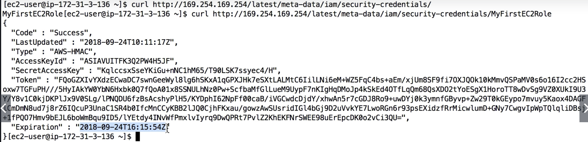

# SAA Prepare - Day 6: Programmatically access AWS

## AWS CLI
- Never put your personal credentials on an EC2. EC2 does not belong to you
- AWS CLI on EC2 - the right way: IAM roles, aws account checks credentials and permissions of the ROLE 
- IAM Roles are used to permission EC2 instances so they can perform API calls on your behalf (one IAM role per EC2)

Test aws policy:
- aws policy simulator (google)
- AWS EC2 Instance Metadata

## AWS EC2 Instance Metadata
- URL: `http://169.254.269.254/latest/meta-data`
    - `169.254.269.254` is an internal Ip that works with AWS but does not work with your local computer
- You can retrieve the IAM **role name** from the metadata, but you cannot retrieve the content of the IAM policy
- Metadata = Info about the EC2 instance
- Userdata = launch script of the EC2 instance

## How IAM role works with EC2

For each of the role attached to the EC2, it has a short-living access credential to grant the necessary permission for the EC2

## AWS SDK
- AWS CLI is using the python SDK (named boto3/botocore)
- For your SDK, if you do not specify a region or configure a default region, `us-east-1` will be chosen by default

### AWS SDK Credentials Security
- It’s recommend to use the default credential provider chain
- The default credential provider chain works seamlessly with:
  - AWS credentials at ~/.aws/credentials (only on our computers or on premise)
  - Instance Profile Credentials using IAM Roles (for EC2 machines, etc…)
  - Environment variables (AWS_ACCESS_KEY_ID, AWS_SECRET_ACCESS_KEY)
- **NEVER EVER STORE AWS CREDENTIALS IN YOUR CODE**
- Best practice is for credentials to be inherited from mechanisms above, and 100% IAM Roles if working from within AWS Services

### Exponential Backoff
- Any API that fails because of too many calls needs to be retried with Exponential Backoff
- Exponential Backoff is included in most SDKs
- Exponential Backoff means that if your API calls still keep on failing we will wait twice as long as the previous API call to try again, and that ensures that you don't overload the API by trying it every millisecond

