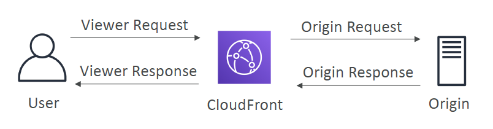

# SAA Prepare - Day 9: AWS Lambda，DynamoDB，AWS API Gateway AWS Cognito， Serverless Architectures

## Serverless
- Serverless does not mean there are no servers… it means you just don’t manage / provision / see them

## AWS Lambda
- Virtual **functions** – no servers to manage!
- Limited by time - **short executions**
- Run **on-demand**
- Scaling is automated

### Benefits of AWS Lambda
- Easy Pricing (It is usually very cheap to run AWS Lambda):
    - Pay **per request** and **compute time**
      - Pay per calls:
        1. First 1,000,000 requests are free
        2. $0.20 per 1 million requests thereafter ($0.0000002 per request)
    - Free tier of 1,000,000 AWS Lambda requests and 400,000 GBs of compute time
- Integrated with the whole AWS suite of services
- Integrated with many programming languages 
    - Node.js (JavaScript),Python, Java (Java 8 compatible), C# (.NET Core), Golang, C# / Powershell, Ruby, Custom Runtime API (community supported, example **Rust**)
    - Important: **Docker** is not for AWS Lambda, it’s for **ECS / Fargate**
- Easy monitoring through AWS CloudWatch
- Easy to get more resources per functions (up to 3GB of RAM!)
- Increasing RAM will also improve CPU and network

### AWS Lambda Limits to Know - per region
#### Execution:
- Memory allocation: 128 MB – 3008 MB (64 MB increments)
- Maximum execution time: 900 seconds (15 minutes)
- Environment variables (4 KB)
- Disk capacity in the “function container” (in /tmp): 512 MB
- Concurrency executions: 1000 (can be increased)
#### Deployment:
- Lambda function deployment size (compressed .zip): 50 MB
- Size of uncompressed deployment (code + dependencies): 250 MB
- Can use the /tmp directory to load other files at startup
- Size of environment variables: 4 KB

#### Exam Tips
- The exam will ask a few questions such as we need six gigabytes of RAM, or we need 30 minutes of execution time, or we need a big file of three gigabytes, then you will know that Lambda is not the right way to run this work load.

### Lambda@Edge
- can use Lambda@Edge:deploy Lambda functions alongside your CloudFront CDN
  - Build more responsive applications
  - You don’t manage servers, Lambda is deployed globally
  - Customize the CDN content
  - Pay only for what you use
    
- can use Lambda to change CloudFront requests and responses:
  - After CloudFront receives a request from a viewer (viewer request)
  - Before CloudFront forwards the request to the origin (origin request)
  - After CloudFront receives the response from the origin (origin response)
  - Before CloudFront forwards the response to the viewer (viewer response)
  
- You can also generate responses to viewers without ever sending the request to the origin
    

#### Use Cases

- Website Security and Privacy
- Dynamic Web Application at the Edge
- Search Engine Optimization (SEO)
- Intelligently Route Across Origins and Data Centers
- Bot Mitigation at the Edge
- Real-time Image Transformation
- A/B Testing
- User Authentication and Authorization
- User Prioritization
- User Tracking and Analytics

## DynamoDB

- Fully Managed, Highly available with replication across **3 AZ** by default
- **NoSQL database** - not a relational database
- Scales to massive workloads, distributed database
- Millions of requests per seconds, trillions of row, 100s of TB of storage
- Fast and consistent in performance (low latency on retrieval)
- Integrated with IAM for security, authorization and administration
- Enables event driven programming with DynamoDB Streams
- Low cost and auto scaling capabilities

### DynamoDB – Provisioned Throughput
- Table **must** have provisioned read and write capacity units
- Read Capacity Units (RCU): throughput for reads ($0.00013 per RCU)
  - 1 RCU = 1 strongly consistent read of 4 KB per second
  - 1 RCU = 2 eventually consistent read of 4 KB per second
- Write Capacity Units (WCU): throughput for writes ($0.00065 per WCU)
  - 1 WCU = 1 write of 1 KB per second

- Option to setup auto-scaling of throughput to meet demand
- Throughput can be exceeded temporarily using “burst credit”
- If burst credit are empty, you’ll get a “ProvisionedThroughputException”.
- It’s then advised to do an exponential back-off retry

## DynamoDB Advanced Features
### DynamoDB - DAX
- DAX = DynamoDB Accelerator
- Seamless cache for DynamoDB, no application rewrite
- Writes go through DAX to DynamoDB
- Micro second latency for cached reads & queries
- Solves the Hot Key problem (too many reads)
- 5 minutes TTL for cache by default
- Up to 10 nodes in the cluster
- Multi AZ (3 nodes minimum recommended for production)
- Secure (Encryption at rest with KMS, VPC, IAM, CloudTrail…)
#### DAX is a great way to speed up reads in your application and start caching your DynamoDB data
- A DynamoDB Accelerator (DAX) **cluster** is a cache that **fronts** your DynamoDB tables and caches the most frequently read values. They help offload the heavy reads on hot keys off of DynamoDB itself, hence preventing the ProvisionedThroughputExceededException

### DynamoDB Streams
- Changes in DynamoDB (Create, Update, Delete) can end up in a DynamoDB Stream
- once any changes happens it's going to create a changelog of everything that happened to your table in stream
- This stream can be read by AWS Lambda, and we can then do:
  - React to changes in real time (welcome email to new users)
  - Analytics
  - Create derivative tables / views
  - Insert into ElasticSearch
- Could **implement cross region replication** using Streams
- Stream has 24 hours of data retention

### DynamoDB - New Features
#### Transactions (new from Nov 2018)
- All or nothing type of operations
- Coordinated Insert, Update & Delete across multiple tables
- Include up to 10 unique items or up to 4 MB of data
#### On Demand (new from Nov 2018)
- No capacity planning needed (WCU / RCU) – scales automatically
- **2.5x more expensive** than provisioned capacity (use with care)
- Helpful when spikes are un-predictable or the application is very low throughput

### DynamoDB – Security & Other Features
#### Security:
- VPC Endpoints available to access DynamoDB without internet
- Access fully controlled by IAM
- Encryption at rest using KMS
- Encryption in transit using SSL / TLS
#### Backup and Restore feature available
- Point in time restore like RDS
- No performance impact
#### Global Tables (cross region replication)
- Multi region, fully replicated, high performance
- Must enable DynamoDB Streams
- Useful for low latency, DR purposes

#### Amazon DMS can be used to migrate to DynamoDB (from Mongo, Oracle, MySQL, S3, etc…)
#### You can launch a local DynamoDB on your computer for development purposes

#### Capacity planning:
- Planned capacity: provision WCU & RCU, can enable auto scaling
- On-demand capacity: get unlimited WCU & RCU, no throttle, more expensive

## AWS API Gateway
- AWS Lambda + API Gateway: No infrastructure to manage (full serverless application)
- Support for the **WebSocket** Protocol, we can do real-streaming through the API Gateway in two different ways
- Handle API versioning (v1, v2…)
- Handle different environments (dev, test, prod…)
- Handle security (Authentication and Authorization)
- Create API keys, handle request throttling
- Swagger / Open API import to quickly define APIs
- Transform and validate requests and responses
- Generate SDK and API specifications
- Cache API responses

### API Gateway – Integrations High Level
#### Lambda Function
- Invoke Lambda function
- Easy way to expose REST API backed by AWS Lambda
#### HTTP
- Expose HTTP endpoints in the backend
- Example: internal HTTP API on premise, Application Load Balancer…
- Why? Add rate limiting, caching, user authentications, API keys, etc…
#### AWS Service
- Expose any AWS API through the API Gateway?
- Example: start an AWS Step Function workflow, post a message to SQS
- Why? Add authentication, deploy publicly, rate control…

### API Gateway - Endpoint Types
#### Edge-Optimized (default): For global clients
- Requests are routed through the **CloudFront Edge locations** (improves latency)
- The API Gateway still lives in **only one region**
#### Regional:
- For clients within the **same region**
- Could manually combine with CloudFront (more control over the caching strategies and the distribution)
#### Private:
- Can only be accessed from your VPC using an interface VPC endpoint (ENI)
- Use a resource policy to define access

## API Gateway – Security
### IAM Permissions
- Create an IAM policy authorization and attach to User / Role
- API Gateway verifies IAM permissions passed by the calling application
- Good to provide access within your own infrastructure
- Leverages “**Sig v4**” capability where IAM credential are in headers

### Lambda Authorizer (formerly Custom Authorizers)
- Uses AWS Lambda to validate the token in header being passed
- Option to cache result of authentication
- Helps to use OAuth / SAML / **3rd party** type of authentication
- Lambda must **return an IAM policy** for the user

### Cognito User Pools

- Cognito fully manages user lifecycle
- API gateway verifies identity automatically from AWS Cognito
- No custom implementation required
- Cognito only helps with authentication, not authorization

### Cognito User Pools

- Cognito fully manages user lifecycle
- API gateway verifies identity automatically from AWS Cognito
- No custom implementation required
- Cognito **only helps with authentication**, not authorization

### API Gateway – Security – Summary
#### IAM:
- Great for users / roles already within your AWS account
- Handle **authentication + authorization**
- Leverages **Sig v4**
### Custom Authorizer:
- Great for **3rd party tokens**
- Very flexible in terms of what IAM policy is returned
- Handle **Authentication + Authorization**
- Pay per Lambda invocation
### Cognito User Pool:
- You manage your own user pool (can be backed by Facebook, Google login etc…)
- No need to write any custom code
- Must implement authorization in the backend

## AWS Cognito
- We want to give our users an identity so that they can interact with our application

### AWS Cognito User Pools (CUP)
- Create a serverless database of user for your **mobile apps**
- Simple login: Username (or email) / password combination
- Possibility to verify emails / phone numbers and add MFA
- Can enable Federated Identities (Facebook, Google, SAML…)
- **Sends back a JSON Web Tokens (JWT)**
- Can be integrated with **API Gateway** for **authentication**

### AWS Cognito – Federated Identity Pools

#### Goal:
- Provide **direct access** to **AWS Resources** from the Client Side (no proxy, no API)
#### How:
- Log in to federated identity provider – or remain anonymous
- Get **temporary** AWS credentials back from the Federated Identity Pool
- These credentials come with a pre-defined IAM policy stating their permissions
#### Example:
- provide (temporary) access to write to S3 bucket using Facebook Login

### AWS Cognito Sync (out of scope of saa exam)
- Synchronize data from device to Cognito
- May be deprecated and replaced by AppSync

## AWS SAM - Serverless Application Model
- **Framework** for developing and deploying serverless applications
- All the configuration is YAML code
  - Lambda Functions
  - DynamoDB tables
  - API Gateway
  - Cognito User Pools
- SAM can help you to run Lambda, API Gateway, DynamoDB locally
- SAM can use CodeDeploy to deploy Lambda functions

## Serverless Architectures
- Serverless **REST API**: HTTPS, API Gateway, Lambda, DynamoDB
- Using **Cognito** to generate temporary credentials with **STS** to access S3 bucket with restricted policy. App users can **directly access AWS resources** this way. Pattern can be applied to **DynamoDB**, **Lambda**…
- Caching the reads on DynamoDB using **DAX**
- Caching the REST requests at the **API Gateway level**
- Security for authentication and authorization with Cognito, STS
