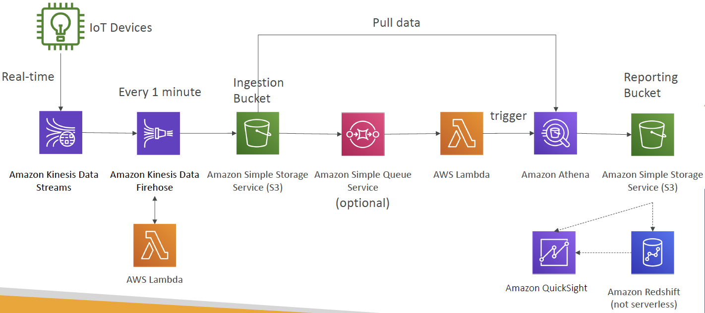

# SAA Prepare - Day 10: Serverless Architectures

## Serverless Architectures
### Case 1 - Mobile application: MyTodoList

#### ? Expose as REST API with HTTPS & Serverless architecture
Serverless **REST API**: HTTPS, API Gateway, Lambda, DynamoDB
#### ? Users should be able to directly interact with their own folder in S3 
Using **Cognito** to generate temporary credentials with **STS** to access S3 bucket with restricted policy. App users can **directly access AWS resources** this way. Pattern can be applied to **DynamoDB**, **Lambda**…

#### ? Users should authenticate through a managed serverless service
Security for authentication and authorization with Cognito, STS
#### ? The users can write and read to-dos, but they mostly read them & The database should scale, and have some high read throughput
- Caching the reads on DynamoDB using **DAX**
- Caching the REST requests at the **API Gateway level**

### Case 2 - Serverless hosted website: MyBlog.com
- S3 Signed URL is not efficient for global access, CloundFront is more efficient for distributing stuff globally
#### ? Serving static content, globally, securely
- static content being distributed using CloudFront with S3
- Use **OAI: Origin Access Identify** from CloudFront to S3 (add a bucket policy: only authorize the OAI to read, the rest cannot)
- leverage a Global DynamoDB table to serve the data globally

#### ? Any new users that subscribes should receive a welcome email

- Enabled DynamoDB streams to trigger a Lambda function, this function has an IAM role which allows us to use SES (Lambda function use the AWS SDK to send emails from Amazon SES)
- SES (Simple Email Service) was used to send emails in a serverless way

#### ? Any photo uploaded to the blog should have a thumbnail generated

### Case 3 - Micro Services architecture

#### ? Want to switch to a micro service architecture
- Synchronous patterns: API Gateway, Load Balancers
- Asynchronous patterns: SQS, Kinesis, SNS, Lambda triggers (S3)
 

- Some of the challenges are solved by Serverless patterns:
  - API Gateway, Lambda scale automatically and you pay per usage
  - You can easily clone API, reproduce environments
  - Generated client SDK through Swagger integration for the API Gateway

### Case 4 - Distributing paid content

#### We have implemented a fully serverless solution:
- Cognito for authentication
- DynamoDB for storing users that are premium
- 2 serverless applications
  - Premium User registration
  - CloudFront Signed URL generator
- Content is stored in S3 (serverless and scalable)
- Integrated with CloudFront with OAI for security (users can’t bypass)
- CloudFront can only be used using Signed URLs to prevent unauthorized users
- What about S3 Signed URL? They’re not efficient for global access

### Case 5 - Software updates offloading
**Q:** We have an application running on EC2, that distributes software updates once in a while. When a new software update is out, we get a lot of request and the content is distributed in mass over the network. It’s very costly. We don’t want to change our application, but want to optimize our cost and CPU, how can we do it?

**A:** Put CloudFront in front of the ELB
- No changes to architecture
- Will cache software update files at the edge
- Software update files are not dynamic, they’re static (never changing)
- Our EC2 instances aren’t serverless. But CloudFront is, and will scale for us
-ASG will not scale as much, and we’ll save tremendously in EC2
 We’ll also save in availability, network bandwidth cost, etc
 Easy way to make an existing application more scalable and cheaper!

### Case 6 - Big Data Ingestion Pipeline

We want the ingestion pipeline to be fully serverless
#### ? We want to collect data in real time
Kinesis is great for real-time data collection
#### ? We want to transform the data
- Firehose helps with data delivery to S3 in **near real-time** (1 minute)
- Lambda can help Firehose with data transformations
#### ? We want to query the transformed data using SQL
Amazon S3 can trigger notifications to SQS
#### ? The reports created using the queries should be in S3
Athena is a serverless SQL service and results are stored in S3
#### ? We want to load that data into a warehouse and create dashboards
The reporting bucket contains analyzed data and can be used by
reporting tool such as AWS QuickSight, Redshift, etc…

