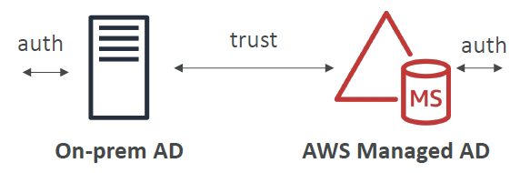
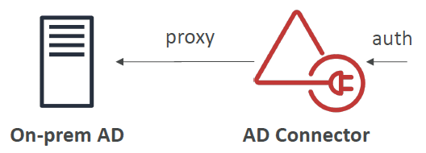

# SAA Prepare - Day 13: Identity and Access Management (IAM) - Advanced

## AWS STS – Security Token Service
- Allows to grant **limited and temporary access** to AWS resources.
- Token is valid for up to **one hour** (must be **refreshed**)
#### AssumeRole
- Within your own account: for enhanced security
- **Cross Account Access**: assume role in target account to perform actions there
#### AssumeRoleWithSAML
- return credentials for users logged with SAML
#### AssumeRoleWithWebIdentity
- return creds for users logged with an IdP (Facebook Login, Google Login, OIDC compatible…)
- AWS recommends against using this, and using **Cognito** instead
#### GetSessionToken
- for **MFA**, from a user or AWS account root user

### Using STS to Assume a Role
• Define an IAM Role within your account or cross-account
• Define which principals can access this IAM Role
• Use AWS STS (Security Token Service) to retrieve credentials and impersonate the IAM Role you have access to (**AssumeRole API**)
• Temporary credentials can be valid between **15 minutes to 1 hour**

### Identity Federation in AWS
- Federation lets users **outside of AWS** to assume temporary role for accessing AWS resources.
- These users assume identity provided access role
- Federations can have many flavors:
  - SAML 2.0
  - Custom Identity Broker
  - Web Identity Federation with Amazon Cognito
  - Web Identity Federation without Amazon Cognito
  - Single Sign On
  - Non-SAML with AWS Microsoft AD
#### Using federation, you don’t need to create IAM users (user management is outside of AWS)

### SAML 2.0 Federation
- To integrate Active Directory / ADFS with AWS (or any SAML 2.0)
- Provides access to AWS Console or CLI (through temporary creds)
- **No** need to create an IAM user for each of your employees

#### SAML 2.0 Federation – Active Directory FS
- Same process as with any SAML 2.0 compatible IdP

### SAML 2.0 Federation
- Needs to setup a trust between AWS IAM and SAML (both ways)
- SAML 2.0 enables web-based, cross domain **SSO**
- Uses the STS API: AssumeRoleWithSAML
- Note federation through SAML is the “old way” of doing things
- **Amazon Single Sign On (SSO)** Federation is the new managed and
simpler way
  
### Custom Identity Broker Application
- Use **only if** identity provider is **not compatible with SAML 2.0**
- The identity broker **must determine the appropriate IAM policy**
- Uses the **STS API**: **AssumeRole** or **GetFederationToken**

### Web Identity Federation – AssumeRoleWithWebIdentity
Not recommended by AWS – use **Cognito** instead (allows for anonymous users, data synchronization, MFA)

### AWS Cognito

- **Goal**: Provide **direct access** to AWS Resources from
the Client Side (mobile, web app)
- **Example**: provide (temporary) access to write to S3
bucket using Facebook Login
- **Problem**: We don’t want to create IAM users for our app
users
- **How**:
  - Log in to federated identity provider – or remain anonymous
  - Get temporary AWS credentials back from the Federated Identity Pool
  - These credentials come with a pre-defined IAM policy stating their permissions
  
## Microsoft Active Directory (AD)
- Found on any Windows Server with AD Domain Services
- Database of objects: User Accounts, Computers, Printers,
File Shares, Security Groups
- Centralized security management, create account, assign permissions
- Objects are organized in trees
- A group of trees is a forest

## AWS Directory Services
using Active Directory, you can create EC2 instances that are going to be running Windows, and these Windows instances can join the domain controllers for your network and share all the logins and the credentials and so on.
### AWS Managed Microsoft AD
- Create your own AD in AWS, manage users locally, supports **MFA**
- Establish “trust” connections with your onpremise AD

### AD Connector
- Directory Gateway (**proxy**) to redirect to onpremise AD
• Users are managed on the on-premise AD
  

### Simple AD
- AD-compatible managed directory on AWS
- Cannot be joined with on-premise AD
- if you don't have an on-premise AD, and you need an Active Directory for your AWS Cloud, then you can have a Simple AD

## AWS Organizations

- **Global service**, allows to manage multiple AWS accounts
- The main account is the master account – you can’t change it
- Other accounts are member accounts
- **Member accounts** can only be part of **one organization**, they can migrate to other 
- **Consolidated Billing across all accounts** - single payment method
- Pricing benefits from aggregated usage (volume discount for EC2, S3…)
- API is available to automate AWS account creation

### Multi Account Strategies
- Enable CloudTrail on all accounts, send logs to central S3 account
- Send CloudWatch Logs to central logging account
- Establish **Cross Account Roles** for Admin purposes

### Service Control Policies (SCP)
- Whitelist or blacklist IAM actions
- Applied at the **OU**(Organizational Units) or **Account** level. Does not apply to the Master Account
- SCP is applied to all the **Users and Roles** of the Account, including Root user
- The SCP does not affect service-linked roles
- SCP must have an explicit Allow (does not allow anything by default)
- Use cases:
  - Restrict access to certain services (for example: can’t use EMR)
  - Enforce PCI compliance by **explicitly disabling services**
  

### AWS Organization – Moving Accounts
#### To migrate accounts from one organization to another
1. Remove the member account from the old
   organization
2. Send an invite to the new organization
3. Accept the invite to the new organization from the
   member account
#### If you want the master account of the old organization to also join the new organization, do the following:
1. Remove the all member accounts from the
   organizations using procedure above
2. Delete the old organization
3. Repeat the process above to invite the old master
   account to the new org
   
## IAM Conditions
- `aws:SourceIP`: restrict the client IP **from** which the API calls are being made
- `Aws:RequestedRegion`: restrict the region The API calls are made **to**

## IAM for S3
- ListBucket permission applies to `arn:aws:s3:::test` => **bucket level permission**

- GetObject, PutObject, DeleteObject applies to `arn:awn:s3:::test/*` => **object level permission**

### IAM Roles vs Resource Based Policies
#### IAM Roles
- When you **assume a role** (user, application or service), you **give up your original permissions** and take the permissions assigned to the role
#### Resource Based Policies
- When using a **resource based policy**, the principal **doesn’t** have to give up his permissions
- Example: User in account A needs to scan a DynamoDB table in Account A and dump it in an S3 bucket in Account B. 
  - why do not use IAM role? If using IAM role to do some stuff in Account B for the S3 bucket then you cannot do anything back on your DynamoDB table in Account A
- Supported by: Amazon S3 buckets, SNS topics, SQS queues

### IAM Permission Boundaries
- supported for users and roles (**not groups**)
- Advanced feature to use a managed policy to set the maximum permissions an IAM entity can get
- Can be used in combinations of AWS Organizations SCP

- Use cases
- Delegate responsibilities to non administrators within their permission boundaries, for example create new IAM users
- Allow developers to self-assign policies and manage their own permissions, while making sure they can’t “escalate” their privileges (= make themselves admin)
- Useful to restrict one specific user(instead of a whole account using Organizations & SCP)

## IAM Policy Evaluation Logic

## AWS Resource Access Manager (RAM)
- Share AWS resources that you own with other AWS accounts
- Share with any account or within your Organization
- Avoid resource duplication!
- VPC Subnets:
    - allow to have all the resources launched in the same subnets
    - must be from the same AWS Organizations.
    - Cannot share security groups and default VPC
    - Participants can manage their own resources in there
    - Participants can't view, modify, delete resources that belong to other participants or the owner
    
### Resource Access Manager – VPC example
#### Each account…
• is responsible for its own resources
• cannot view, modify or delete other resources in other accounts
#### Network is shared so…
• Anything deployed in the VPC can talk to other resources in the VPC
• Applications are accessed easily across accounts, using private IP!
• Security groups from other accounts can be referenced for maximum security

## AWS Single Sign-On (SSO)
- Centrally manage Single Sign-On to access **multiple accounts** and **3rd-party business applications** (you can log in once and you have access to all the things that Single Sign-On is configured to access)
- Integrated with **AWS Organizations** (one login for all the accounts)
- Supports **SAML 2.0** markup
- Integration with on-premise **Active Directory**
- Centralized permission management
- Centralized auditing with **CloudTrail**

### SSO – vs AssumeRoleWithSAML

